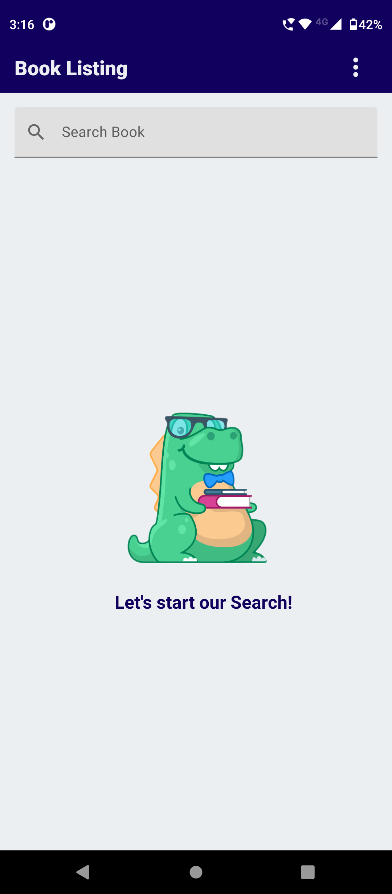
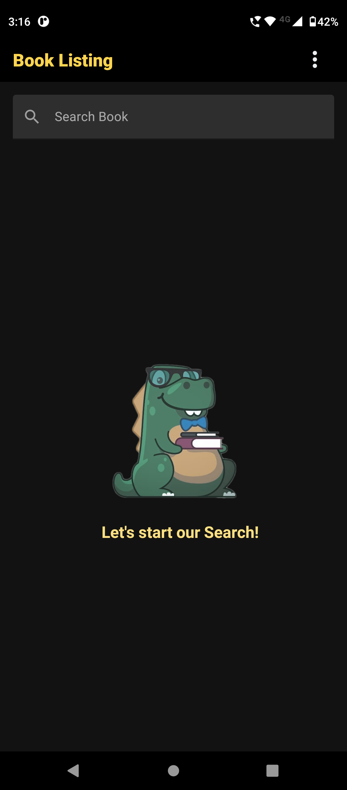
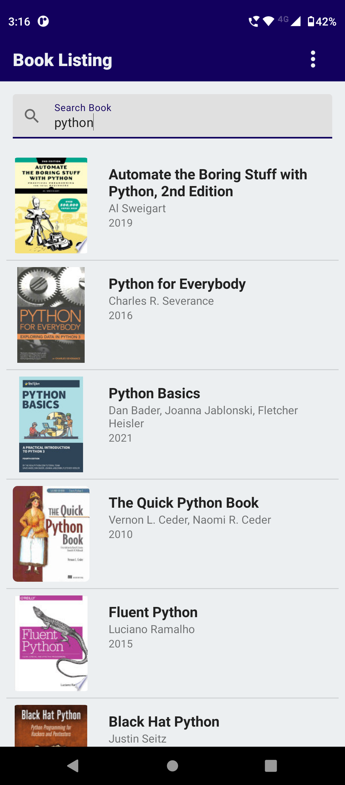
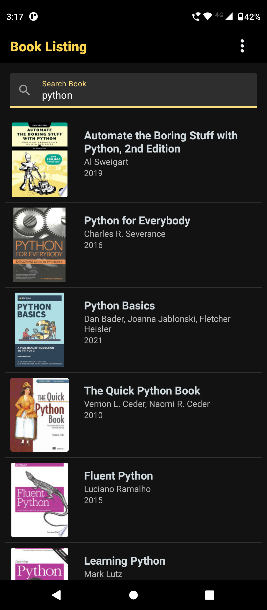

# 📚 Book Listing App

Application for listing all available Books in one place which helps you in Comparing and Selecting the right Books and Saves tons amount of your time. 🚀

## 🚀 Getting Started

This sample uses the Gradle build system. To build this project, use the `gradlew build` command or use "Import Project" in Android Studio.

## 🎨 Features

- Light/dark mode toggle 🌞🌚
- Live previews 📱
- Fullscreen mode 📖
- Native Android App 📱

## 📸 Screenshots

| Light Theme | Dark Theme |
| :-------------------------: | :-------------------------: |
|  |  |
|  |  |

## 📣 Feedback

If you have any feedback, please reach me at ankitshaw1112@gmail.com 📧

## 🔗 Links

